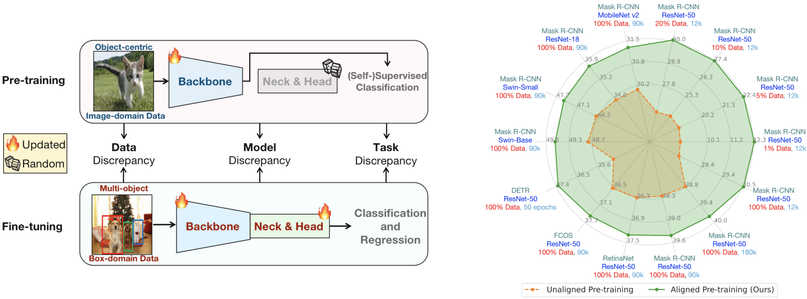
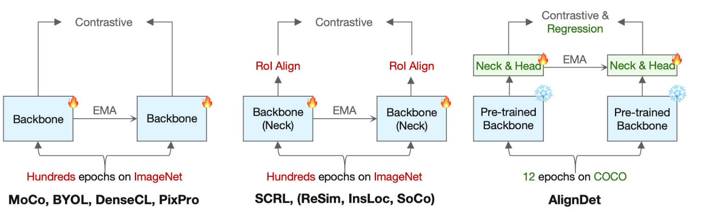
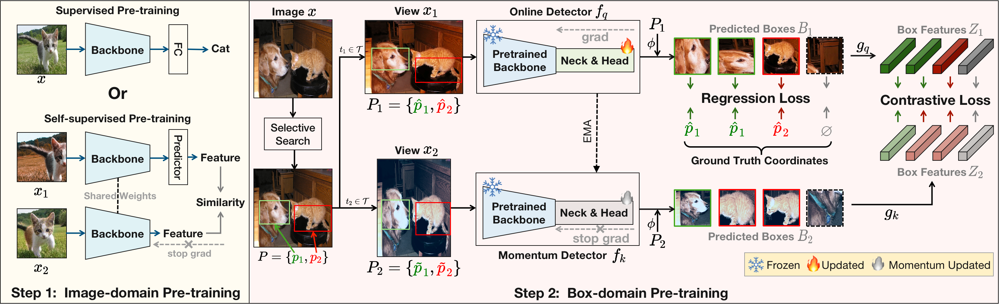

# AlignDet: Aligning Pre-training and Fine-tuning in Object Detection [[Project Page]](https://liming-ai.github.io/AlignDet/)
Official PyTorch Implementation of [AlignDet: Aligning Pre-training and Fine-tuning in Object Detection (ICCV 2023)](http://arxiv.org)
* Existing detection algorithms are constrained by the data, model, and task discrepancies between pre-training and fine-tuning.
* AlignDet aligns these discrepancies in an efficient and unsupervised paradigm, leading to significant performance improvements across different settings.



Comparison with other self-supervised pre-training methods on data, models and tasks aspects. AlignDet achieves more efficient, adequate and detection-oriented pre-training



Our pipeline takes full advantage of the existing pre-trained backbones to efficiently pre-train other modules. By incorporating self-supervised pre-trained backbones, we make the first attempt to fully pre-train various detectors using a completely unsupervised paradigm.




## Data Download
Please download the [COCO 2017 dataset](https://cocodataset.org/), and the folder structure should be:
```
data
├── coco
│   ├── annotations
│   ├── filtered_proposals
│   ├── semi_supervised_annotations
│   ├── test2017
│   ├── train2017
│   └── val2017
```

The folder `filtered_proposals` for self-supervised pre-training can be downloaded in [Google Drive](https://drive.google.com/file/d/1AR1xXyeeLowHFXpS0hGB6VcORLxi9C2o/view?usp=sharing).

The folder `semi_supervised_annotations` for semi-supervised fine-tuning can be downloaded in [Google Drive](https://drive.google.com/file/d/1CyXw412wuXJvqrXF0VDRkp6k5SZPP_up/view?usp=sharing), or generated by `tools/generate_semi_coco.py`


## Environments
```bash
# Sorry our code is not based on latest mmdet 3.0+
pip3 install -r requirements.txt
```

## Pre-training and Fine-tuning
### Pre-training
```bash
bash tools/dist_train.sh configs/selfsup/mask_rcnn.py 8 --work-dir work_dirs/selfsup_mask-rcnn
```

### Fine-tuning
1. Using `tools/model_converters/extract_detector_weights.py` to extract the weights.
```bash
python3 tools/model_converters/extract_detector_weights.py \
work_dirs/selfsup_mask-rcnn/epoch_12.pth  \ # pretrain weights
work_dirs/selfsup_mask-rcnn/final_model.pth  # finetune weights
```

2. Fine-tuning models like normal mmdet training process, usually the learning rate is increased by 1.5 times, and the weight decay is reduced to half of the original setting. Please refer to the released logs for more details.
```bash
bash tools/dist_train.sh configs/coco/mask_rcnn_r50_fpn_1x_coco.py 8 \
--cfg-options load_from=work_dirs/selfsup_mask-rcnn/final_model.pth \ # load pre-trained weights
optimizer.lr=3e-2 optimizer.weight_decay=5e-5  \ # adjust lr and wd
--work-dir work_dirs/finetune_mask-rcnn_1x_coco_lr3e-2_wd5e-5
```

## TODO
- [x] Code release.
- [x] Environment preparation tutorial.
- [x] Release json files used for pre-training and semi-supervised fine-tuning.
- [ ] Release all the checkpoints and logs.

## Checkpoints and Logs (TODO)
All the checkpoints and logs will be uploaded to [this Google Drive Folder](https://drive.google.com/drive/folders/1bLCNViQ3JT0Al_7LK0Xyixh1PrdkyM0-?usp=sharing).


### Different methods
| Method (Backbone) | Pre-training Checkpoint | Pre-training Log | Fine-tuning Checkpoint | Fine-tuning Log |
|:------------------------:|:-----------------------:|:----------------:|:----------------------:|:---------------:|
| FCOS (R50)               |                         |                  |                        |                 |
| RetinaNet (R50)          |                         |                  |                        |                 |
| Faster R-CNN (R50)       |                         |                  |                        |                 |
| Mask R-CNN (R50)         |                         |                  |                        |                 |
| DETR  (R50)              |                         |                  |                        |                 |
| SimMIM (Swin-B)      |                         |                  |                        |                 |
| CBNet v2 (Swin-L)   |                         |                  |                        |                 |


### Mask R-CNN with different backbones
| Backbone | Pre-training Checkpoint | Pre-training Log | Fine-tuning Checkpoint | Fine-tuning Log |
|:---------------:|:-----------------------:|:----------------:|:----------------------:|:---------------:|
| MobileNetv2     |                         |                  |                        |                 |
| ResNet-18       |                         |                  |                        |                 |
| ResNet-50       |                         |                  |                        |                 |
| Swin-Small      |                         |                  |                        |                 |
| Swin-Base       |                         |                  |                        |                 |


## Citation
If you find our work to be useful for your research, please consider citing.
```
@article{aligndet,
  title={AlignDet: Aligning Pre-training and Fine-tuning in Object Detection},
  author={Ming Li and Jie Wu and Xionghui Wang and Chen Chen and Jie Qin and Xuefeng Xiao and Rui Wang and Min Zheng and Xin Pan},
  journal={arXiv preprint arXiv:2307.11077},
  year={2023}
}
```